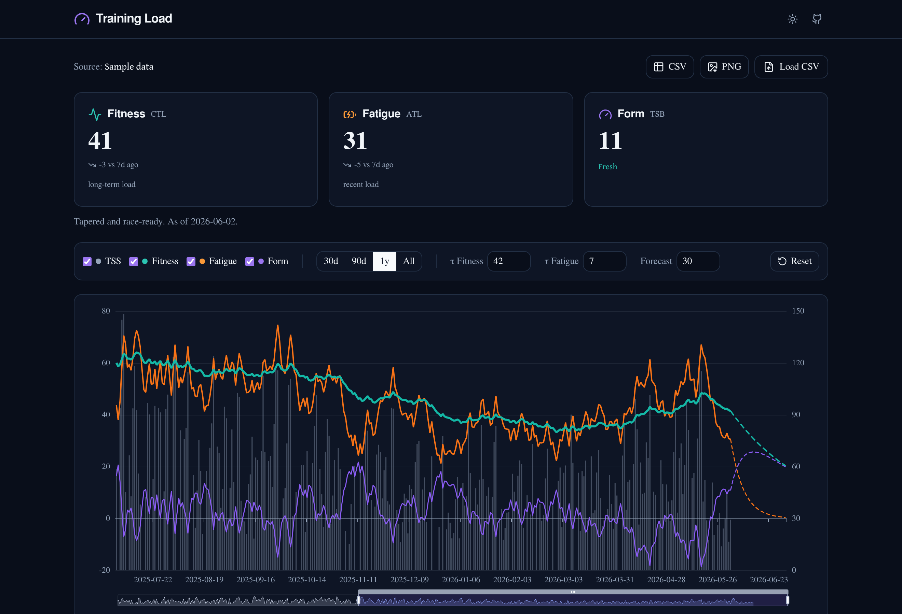
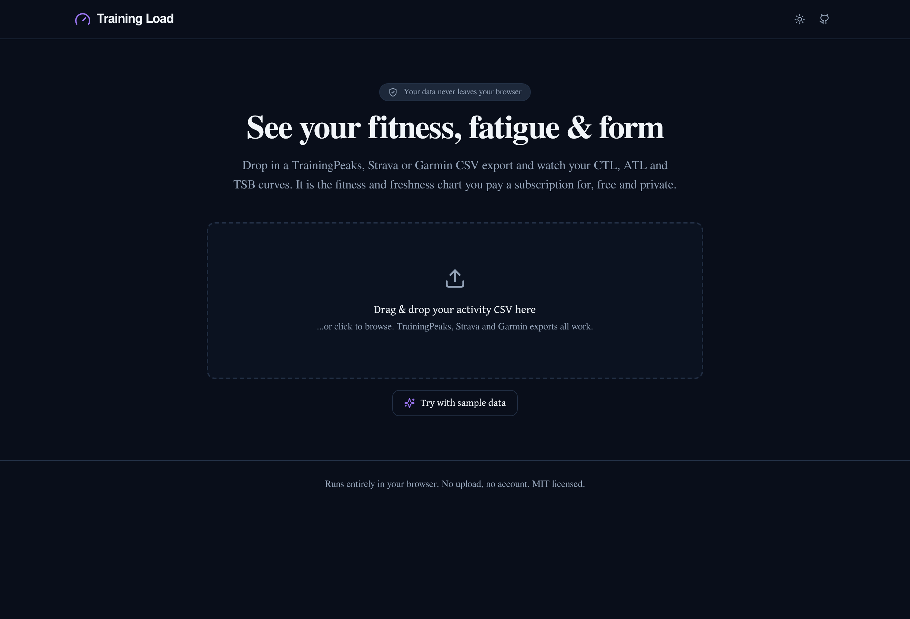
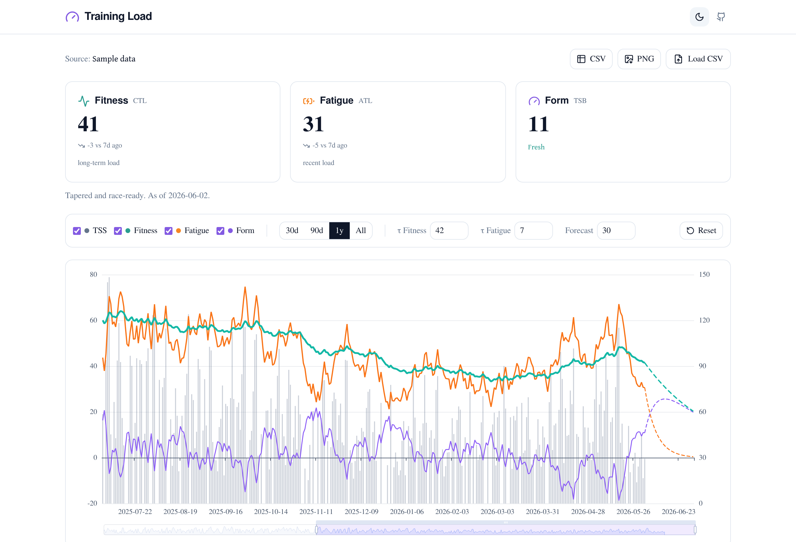

# Training Load

See your fitness, fatigue, and form. Free, private, and running entirely in your browser.

A local alternative to the Strava / TrainingPeaks "Fitness and Freshness" chart.
Load a workout CSV and the app shows your CTL (fitness), ATL (fatigue), and TSB
(form) curves, plus a forecast of how your form recovers. All computation happens
client-side, so your training data never leaves your device.

[](LICENSE)
[▶ Live demo](https://simonpelz.github.io/TrainingLoad/)



## Features

- CTL, ATL and TSB computed with the standard recursive EWMA (tau = 42 / 7).
- A forecast that projects the curves forward so you can see your form recover.
- Negative form (TSB) shown correctly, with a zero reference line. Most simple
  charts clip this.
- Drag-and-drop CSV with automatic column detection, plus manual column mapping
  for any export format.
- Adjustable time constants, forecast horizon, series toggles and timeframe.
- Export the chart as PNG or the computed metrics as CSV.
- Light and dark themes, responsive layout.
- No upload, no account, no server, no analytics.

| Empty state | Light theme |
|---|---|
|  |  |

## How it works

For each calendar day, the app sums the TSS of all activities, fills rest days
with zero, and runs a recursive exponentially-weighted moving average:

```
alpha       = 1 - exp(-1 / tau)
value_today = value_yesterday + alpha * (tss_today - value_yesterday)
```

with `tau = 42` for CTL (chronic, "fitness") and `tau = 7` for ATL (acute,
"fatigue"). TSB (form) is `CTL - ATL`: positive means fresh, negative means
fatigued. Both time constants are adjustable in the UI.

## Getting your data

The app needs a CSV with a date column and a training-load (TSS) column. It
auto-detects common names; if it cannot, it asks you to pick the columns.

| Source | How |
|---|---|
| TrainingPeaks | Export your workouts. The file already has `WorkoutDay` and `TSS` columns and is detected automatically. |
| Garmin Connect | Export activities. If you record power or HR you will have a training-load metric; map it to the TSS column. |
| Strava | Use the bulk export (`activities.csv`) and map "Relative Effort" to the TSS column. The units differ from true TSS, but the fitness, fatigue and form trends are still meaningful. |
| Anything else | Any CSV with a date and a numeric effort/load column works. Just map them. |

For step-by-step export instructions, see [docs/EXPORTING.md](docs/EXPORTING.md).

Most apps only export about a year at a time. You can drop several CSVs at once
(or add them one by one) and the app stitches them into a single view, removing
exact-duplicate activities so overlapping ranges are not double-counted. Use
"Combined CSV" to download the stitched result as one file.

No data to hand? Click "Try with sample data" to explore with a realistic
synthetic dataset.

## Run it locally

Web app (the product):

```bash
cd web
npm install
npm run dev
```

Then open http://localhost:5173.

Desktop app (the original Python/Tkinter version, offline):

```bash
cd desktop
python -m venv .venv && source .venv/bin/activate
pip install -r requirements.txt
sudo apt install python3-tk   # Debian/Ubuntu only
./run.sh
```

## Deploy

A GitHub Actions workflow ([.github/workflows/deploy.yml](.github/workflows/deploy.yml))
builds `web/` and publishes it to GitHub Pages on every push to `main`.
Enable it under Settings, Pages, Build and deployment, Source: GitHub Actions.

## Tech

Vite, React, TypeScript, Tailwind CSS, Apache ECharts and PapaParse. The
CTL/ATL/TSB engine lives in [web/src/core/](web/src/core) and is covered by
Vitest tests that assert parity with the Python implementation.

## Development

```bash
cd web
npm run lint
npm test
npm run build
```

See [docs/ROADMAP.md](docs/ROADMAP.md) for the project plan.

## Disclaimer

This project is not affiliated with, endorsed by, or sponsored by Strava,
TrainingPeaks, Garmin or Peaksware. All product names and trademarks are the
property of their respective owners and are used only to describe compatibility
and context. TSS, CTL, ATL and TSB are training-load metrics drawn from the
sports-science literature and from those platforms. The app is provided for
informational purposes only and is not medical, training or coaching advice.

## License

Licensed under the [MIT License](LICENSE). Copyright Simon Pelz.
